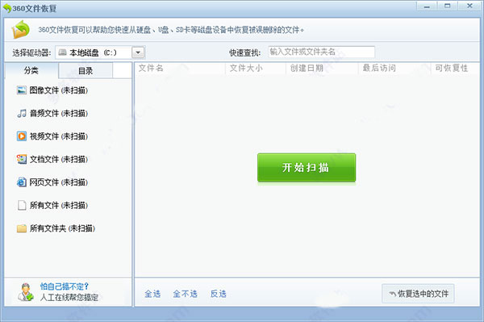

# 文件恢复工具（File Recovery）

收集整理一些好用、免费、绿色免安装的文件恢复工具（File Recovery），如360文件恢复工具等。

（注意：本项目入选的软件首要标准是：免费，收费软件不收录。比如360文件恢复工具最新版本是收费的，故只收录旧的免费版本）

## 赞助支持：

支持本程序，请到Gitee和GitHub给我们点Star！

Gitee：https://gitee.com/dengzhenhua/File-Recovery

GitHub：https://github.com/dengcao/File-Recovery

## 关于

开发：[邓草博客 blog.5300.cn](http://blog.5300.cn)

赞助：[品络互联 www.pinluo.com](http://www.pinluo.com)  &ensp;  [AI工具箱 5300.cn](http://5300.cn)  &ensp;  [汉语言文学网 hyywx.com](http://hyywx.com)  &ensp;  [雄马 xiongma.cn](http://xiongma.cn) &ensp;  [优惠券 tm.gs](http://tm.gs)

## 部分文件恢复工具介绍

### 360文件恢复v1.0绿色版：

360文件恢复独立版，一款功能强悍的数据恢复软件，能够帮助用户从各种存储介质中恢复误删除、格式化或丢失的文件。无论是照片、视频、音频还是办公文档，360文件恢复都可以高效地扫描并恢复这些文件。

**360文件恢复独立版优势**

1.文件扫描速度快，只需一两分钟就能扫描到全盘被删除文件

2.恢复能力强，可一键对多个文件进行恢复

3.恢复种类多，支持对视频、文档、网页等类型的文件进行扫描和恢复

4.能够对电脑磁盘、u盘、sd卡等存储设备中的文件进行恢复

**360文件恢复独立版亮点**

1.恢复用户从回收站删除的文件

2.恢复用户用Shift+Delete删除的文件

3.支持从硬盘，U盘及SD卡恢复丢失文件

4.用户可指定要恢复的盘符，可以通过文件名或者文件类型来精确查找丢失文件

**360文件恢复独立版使用方法**

1.运行软件，点击左侧选择驱动器旁边的选择框，选择所需要恢复文件之前存放的盘符号。

2.点击开始搜索，等待搜索完成，查看需要恢复的文件，勾选文件，可连续勾选多个文件，右键弹出选择菜单

3.点击恢复选中的文件，即可进入文件夹选择菜单，选择文件恢复后存放地址(此处需要注意，不能选择与删除之前存放的同一盘符)，选择完成后点击确定。

4.等待文件恢复完成，即可在选择保存的文件夹中找到该文件。
